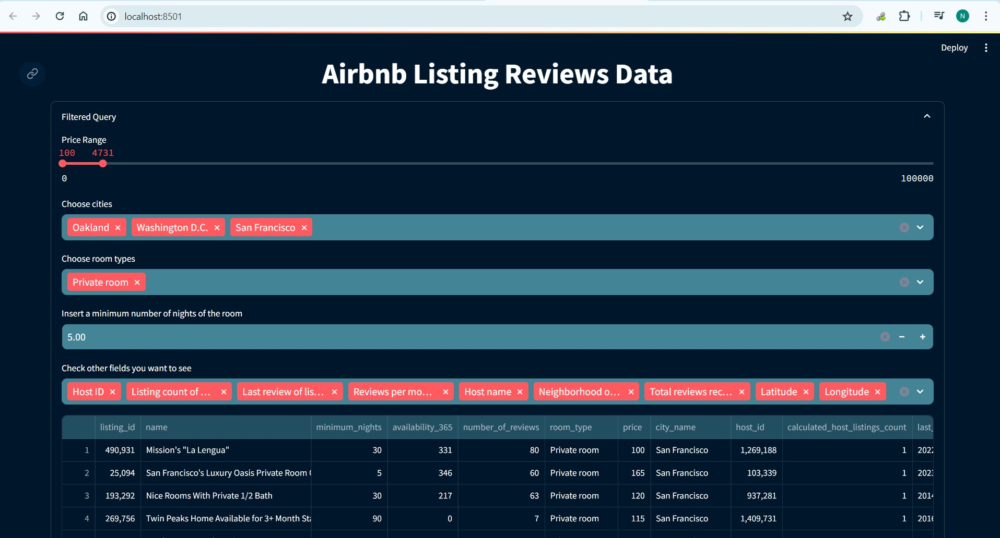
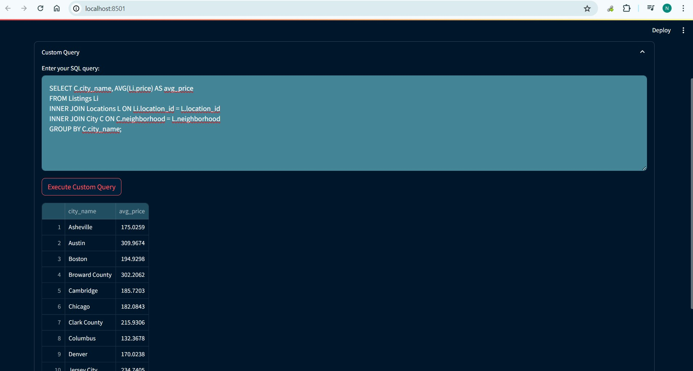

# Airbnb-Listings-Reviews-Database-system
This project involves creating a comprehensive database system to manage and query Airbnb listing reviews sourced from CSV files. The system is designed to efficiently handle review data, enabling users to gain valuable insights through structured queries.

## Project Overview

This repository contains the necessary scripts and instructions to build a database system for Airbnb reviews. The system includes data acquisition, database schema design, data cleaning and transformation, and loading data into a database. It also provides sample queries to extract useful information from the database.

## Features

- **Data Acquisition**: Load review data from CSV files.
- **Database Design**: Create a robust schema with tables for Listings, Reviewers, and Reviews.
- **Data Cleaning and Transformation**: Process and normalize data for consistency and accuracy.
- **Data Loading**: Efficiently load cleaned data into the database.
- **Querying**: Perform complex queries to extract meaningful insights from the reviews.


## Getting Started

- Prerequisites:
    - Pgadmin4 and Postgress
    - Python3.8
        - Python Packages
            - streamlit (pip install streamlit)
            - pandas (pip install pandas)
            - psycopg2 (pip install psycopg2)

1. **Clone the repository**:
   ```bash
   https://github.com/Neilpatel5502/Airbnb-Listings-Reviews-Database-system.git
   cd Airbnb-Listings-Reviews-Database-system

2. **Create Postgress Database**:
    - Create database name airbnb_listing_reviews in the Pgadmin4 with owner as postgres.

3. **Create Database Schema**:
    - upload and run create.sql file into Pgadmin4 in airbnb_listing_reviews database.

4. **Load data into the Databse**:
    - run load.py file from the cmd.
    - How to Run python file.
        ```bash
        python load.py <db-name> <user> <password> <host> <port>
    - sample command to run file.
        ```bash
        python load.py airbnb_listing_reviews postgres password localhost 5432
    - This python file will import the data from csvs located in the data/ directory into database.

5. **Launch the Web application**
    - run app.py file from the cmd in local.
        ```bash
        streamlit run app.py <db-name> <user> <password> <host> <port>
    - sample command to run file.
        ```bash
        streamlit run app.py airbnb_listing_reviews postgres password localhost 5432
    - To view web application.
        - http://localhost:8501
        - http://127.0.0.1:8501
    - .streamlit/ folder is configuration for streamlit framework.

6. **Sample Queries**:
    - Listing details along with its Locations.
        ```sql
        SELECT listing_id, L.neighborhood, C.city_name, L.latitude, L.longitude, R.room_type, Li.price
        FROM Listings Li
        INNER JOIN Locations L ON Li.location_id = L.location_id
        INNER JOIN City C ON C.neighborhood = L.neighborhood
        INNER JOIN Room_types R ON Li.room_type_id = R.room_type_id;

    - calculates the average price of listings for each city
        ```sql
        SELECT C.city_name, AVG(Li.price) AS avg_price
        FROM Listings Li
        INNER JOIN Locations L ON Li.location_id = L.location_id
        INNER JOIN City C ON C.neighborhood = L.neighborhood
        GROUP BY C.city_name;

## Application
- Filtered Query

    

- Custom Query

    
